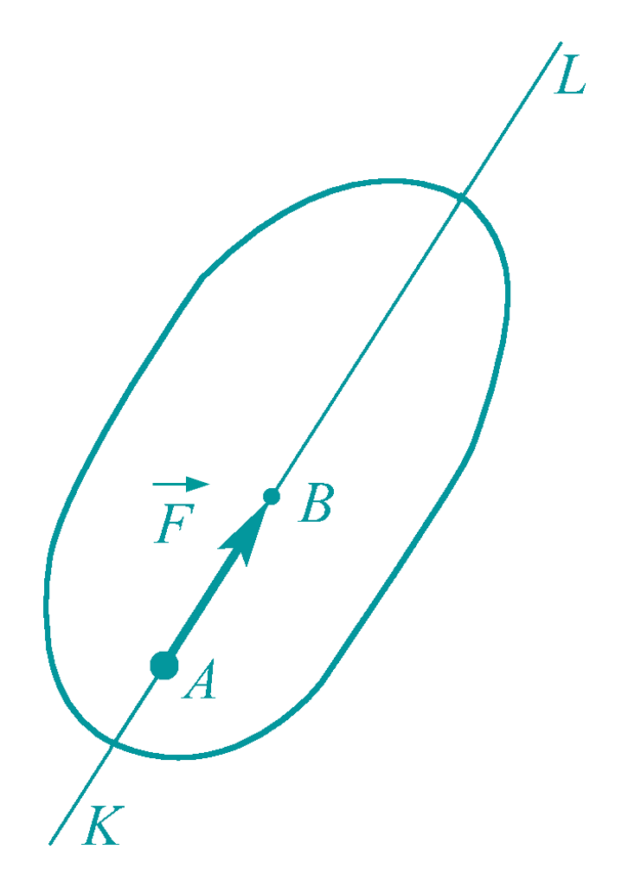

@def title = "基本概念和原理"
@def hascode = true
@def date = Date(2022, 8, 26)
@def rss = "基本概念和原理"

@def tags = ["syntax", "code"]

# 基本概念及基本原理
## 力的概念

*力是什么？*

<!--  -->
~~~

  

    
    

    力是物体间的相互机械作用，这种作用使物体的运动状态发生改变（外效应），或使物体产生变形（内效应）。力使物体运动状态改变的效应称为力的运动效应，使物体产生变形的效应称为力的变形效应。
    

    

      
  

~~~
> 力对物体作用的效应取决于力的三要素，即力的**大小**、**方向**、**作用点**。 （1.这种矢量又叫什么？*定位矢*。2.力一定是定位矢吗？为什么？）

度量力的大小通常采用国际单位制（SI）, 力的单位用牛顿（N）或千牛顿（kN）。

> 注意向量和标量的区分。教材：$\boldsymbol{F}$,$F$, 作业：$\overrightarrow{F}$,$\overline{F}$

## 静力学基本原理
### 公理1 平行四边形法则（[力(矢量)的运算法则]）
第一个公理是力的平行四边形法则
~~~

    

        
    

~~~

$$
\overrightarrow{\boldsymbol{F}}_R = \overrightarrow{\boldsymbol{F}}_1+\overrightarrow{\boldsymbol{F}}_2
$$

### 公理2 二力平衡条件
第二个公理是二力平衡的条件。
作用在刚体上的两个力，使刚体保持平衡的必要和充分条件是：这两个力的**大小相等**，**方向相反**，且作用在**同一直线上**。
~~~

    

        
    
        

~~~

使刚体平衡的充分必要条件：
$$
\overrightarrow{\boldsymbol{F}}_1 = -\overrightarrow{\boldsymbol{F}}_2
$$
最简单力系的平衡条件。

### 公理3 加减平衡力系原理 
在任一力系中加上一个平衡力系，或从其中减去一个平衡力系，所得新力系与原力系对于刚体的运动效应相同。

> 推理： _力的可传性_
> 作用在**刚体**上的力是**滑动矢量**，力的三要素为**大小、方向和作用线**。（注意是同一刚体）

~~~

    

        
    

~~~

### 公理4  作用与反作用定律 
作用力和反作用力总是同时存在，同时消失，**等值、反向、共线**，作用在相互作用的两个物体上．
$$
\overrightarrow{\boldsymbol{F}} = -\overrightarrow{\boldsymbol{F}^\prime}
$$

## **力的分解与力的投影** 
$$
\overrightarrow{\boldsymbol{F}}=\overrightarrow{\boldsymbol{F}}_{12}+\overrightarrow{\boldsymbol{F}}_{3}=\overrightarrow{\boldsymbol{F}}_{1}+\overrightarrow{\boldsymbol{F}}_{2}+\overrightarrow{\boldsymbol{F}}_{3}
$$
> 分解式$\overrightarrow{\boldsymbol{F}}=F_x \overrightarrow{\boldsymbol{i}}+F_y \overrightarrow{\boldsymbol{j}}+F_z \overrightarrow{\boldsymbol{k}} $
~~~

    

        
    

~~~
投影$F_x = \overrightarrow{\boldsymbol{F}}\cdot\overrightarrow{\boldsymbol{i}}$，$F_y = \overrightarrow{\boldsymbol{F}}\cdot\overrightarrow{\boldsymbol{j}}$，$F_z = \overrightarrow{\boldsymbol{F}}\cdot\overrightarrow{\boldsymbol{k}}$

### 直接投影法
~~~

    

        
    

~~~
$$
F_x = F \cos\alpha,\ F_y = F \cos\beta, F_z = F \cos\gamma
$$
~~~

    

        
    

~~~
力在任意轴上的投影
$$
F_t = \overrightarrow{F}\cdot\overrightarrow{n}
= F_x \cos \alpha + F_y \cos \beta + F_z \cos \gamma
$$
$$
\overrightarrow{F} = F_x \overrightarrow{\boldsymbol{i}} + F_y \overrightarrow{\boldsymbol{j}} + F_z \overrightarrow{\boldsymbol{j}} 
$$
$$
\overrightarrow{n} = \cos \alpha \overrightarrow{\boldsymbol{i}} + \cos \beta \overrightarrow{\boldsymbol{j}} + \cos \gamma \overrightarrow{\boldsymbol{k}}
$$
### 二次（间接投影法）
在直接知道$\overrightarrow{\boldsymbol{F}}$和各个坐标的夹角，利用上述的直接投影法可以很容易得到$\overrightarrow{\boldsymbol{F}}$在各个坐标轴上的投影。
但是如果仅仅知道$\overrightarrow{\boldsymbol{F}}$和轴与一个平面的夹角$\varphi$和$\theta$，则可以利用二次投影法来进行投影。
~~~

    

        
    

~~~

二次投影法求投影的解析表达式为：
$$
\begin{split}
F_x & = F^\prime \cos\theta = F \sin \gamma \cos \theta \\
F_y & = F^\prime \sin\theta = F \sin \gamma \sin \theta \\
F_z & = F \cos \gamma \\
\end{split}
$$

若已知力在$x$、$y$、$z$轴上的投影 ，则可求得$F$的大小及方向余弦：
$$
F = \sqrt{F_x^2+F_y^2+F_z^2}
$$

$$
\cos \alpha = \frac{F_x}{F},\ 
\cos \beta = \frac{F_y}{F},\ 
\cos \gamma = \frac{F_z}{F},\ 
$$

> 在实际计算投影的过程中，可以根据以力$\overrightarrow{\boldsymbol{F}}$为对角线，各边平行于坐标轴的长方体的各个边长的大小来判断投影的大；再根据力与坐标轴正方向的夹角来判断投影的正负符号。
---

